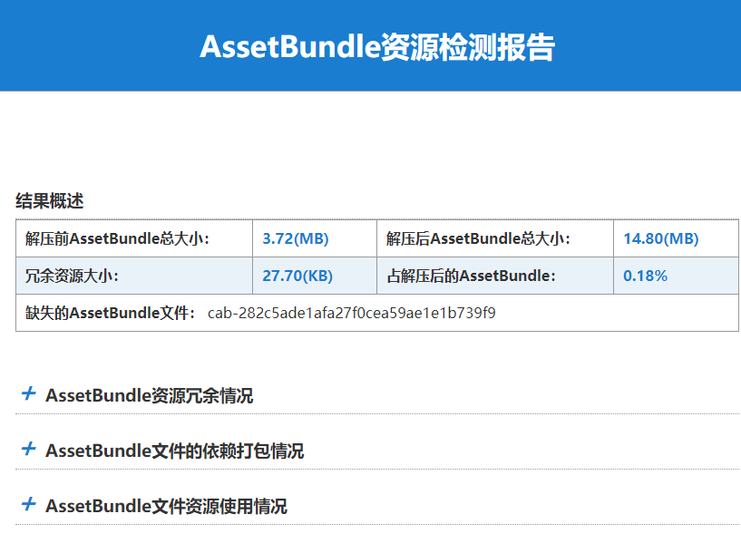

# AssetBundleTools

Analyze the redundancy of the unity assets bundle based on [UABE](https://github.com/DerPopo/UABE) and generate html report.

# Requirements

- VS 2015
- UABE v2.1.d

# Usage 

AssetBundleTools.exe  [Asset Bundle Directory] [Output Directory]

# Example

# Thanks

- [UABE](https://github.com/DerPopo/UABE)

# LICENSE

See [LICENSE](LICENSE)

Copyright © The bingosam Project. All Rights Reserved.
